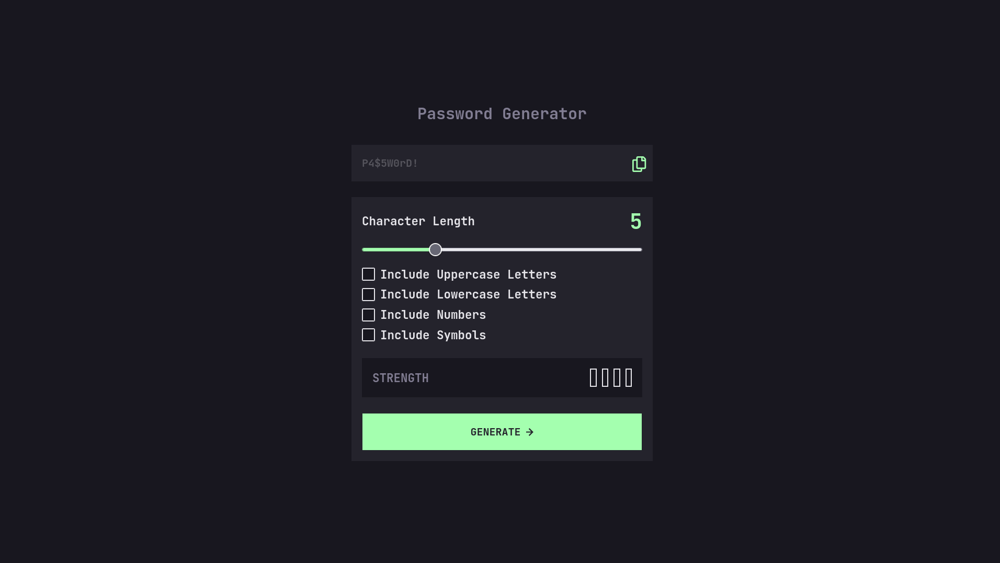
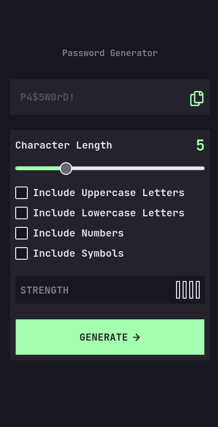

# Frontend Mentor - Password generator app solution

This is a solution to the [Password generator app challenge on Frontend Mentor](https://www.frontendmentor.io/challenges/password-generator-app-Mr8CLycqjh). Frontend Mentor challenges help you improve your coding skills by building realistic projects. 

## Table of contents

- [Overview](#overview)
  - [The challenge](#the-challenge)
  - [Screenshot](#screenshot)
  - [Links](#links)
- [My process](#my-process)
  - [Built with](#built-with)
  - [What I learned](#what-i-learned)
  - [Continued development](#continued-development)
  - [Useful resources](#useful-resources)
- [Author](#author)

## Overview

Application to generate random passwords where you can define the aspects of the same such as its length and the type of characters it includes.

### The challenge

Users should be able to:

- Generate a password based on the selected inclusion options
- Copy the generated password to the computer's clipboard
- See a strength rating for their generated password
- View the optimal layout for the interface depending on their device's screen size
- See hover and focus states for all interactive elements on the page

### Screenshot

### Links

- Solution URL: [Add solution URL here](https://your-solution-url.com)
- Live Site URL: [Add live site URL here](https://your-live-site-url.com)

## My process

### Built with

- Semantic HTML5 markup
- CSS custom properties
- Mobile-first workflow
- [Tailwind CSS](https://tailwindcss.com/) - CSS framework
- [React](https://reactjs.org/) - JS library
- [Next.js](https://nextjs.org/) - React framework

### What I learned

- How to generate random passwords with Next Js
- How to use context instead of passing props between components

### Continued development

I would like to focus on the use of routes in Next Js.

### Useful resources

- [Example resource 1](https://marek-rozmus.medium.com/styling-checkbox-with-tailwind-46a92c157e2d) - This helped with the checkbox and the svg for checked.

## Author

- Website - [Laura Elena Mesa](https://portfolio-app-three-red.vercel.app/)
- Frontend Mentor - [@laurymesa01](https://www.frontendmentor.io/profile/laurymesa01)
- LinkedIn - [@lauraelenamesa](https://www.linkedin.com/in/lauraelenamesa/)

